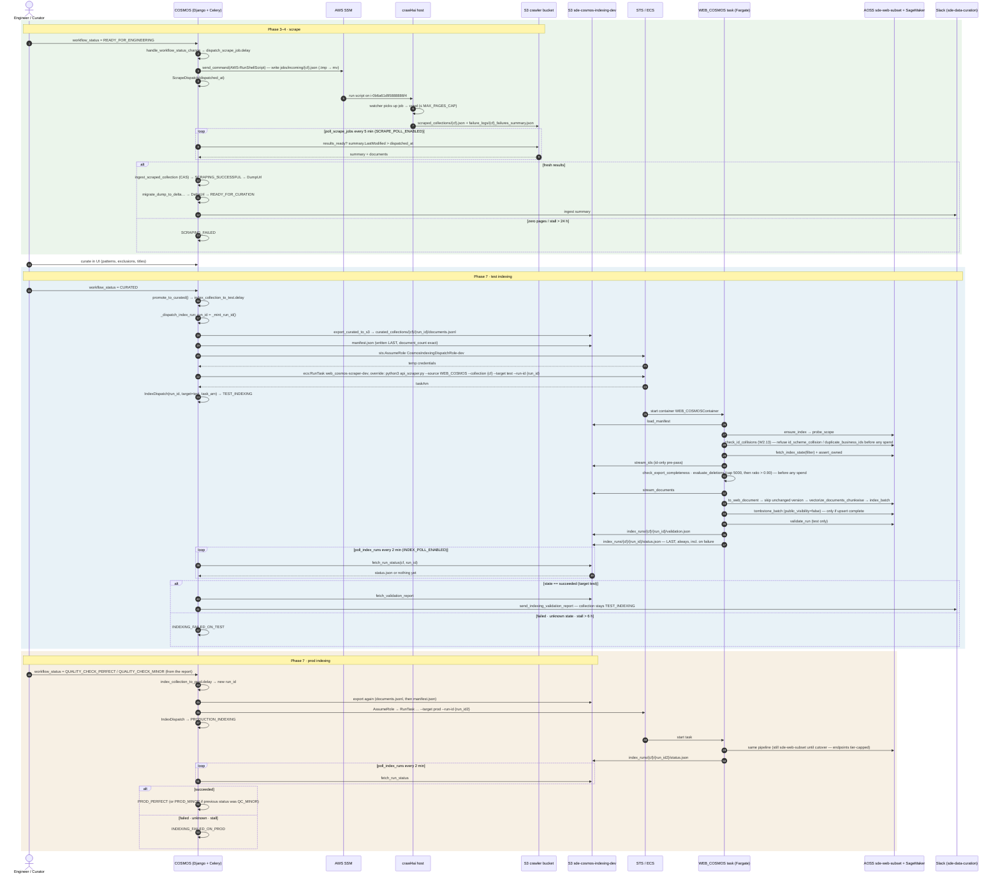

# Web Indexing Hand-off — Status Update & Remaining To-Do (Indexer + COSMOS)

## Status overview — 2026-08-20

> **Verified 2026-08-18** against `COSMOS@9e18ced8` (working tree), `sde-api-scrapers@10975ee`, and the live
> `sde-dev` account (`998871305517`). Corrections made in this pass: `get_chunker` import path (I.1), C.2 needs
> `manage.py migrate` for the beat row, C.3 S3 probes rewritten (role has `AmazonS3FullAccess`; bucket policy has
> no `ListBucket`), `dispatch_scrape --collection`, ratio guard is `>` not `≥`, four (not three) ownership
> boundaries, `+67` tests (not `47+`), I.3 subnet/SG values pre-filled, `:latest` overwrite caveat in I.1, and
> the uploader endpoint tier-cap gap recorded as an indexer to-do.
>
> **Retarget 2026-08-19 (`10975ee`):** the branch-era working index is now **`sde-web-subset`**, a scratch
> *subset* of live `sde-web`, replacing `sde-web-copy` (the full 431k-doc copy) as every runtime default
> (`web/web_pipeline.py`, `infrastructure/config/settings.py`, `api_scraper.py`, `scripts/audit_index.py`) and
> the value pinned by `tests/test_infra_web_env.py`. `sde-web-copy` still exists in dev AOSS but nothing on the
> branch targets it. Verifications dated before 2026-08-19 in the indexer tracker were done against the copy;
> the tracker's new **OOB.3** (confirm `sde-web-subset` carries the `version: keyword` mapping + access-policy
> coverage) must pass before I.4 *(it did — verified 2026-08-20, see below)*. This file has been
> updated to the subset throughout.
>
> **Deployed 2026-08-20 (per the indexer tracker):** `web-indexing` was **merged to `develop` (PR #47 @
> `c2aebad`) and the stacks deployed to dev — NS.2 (I.1/I.2 here) is DONE.** Stack outputs verified by the
> indexer team: `sde-cosmos-indexing-dev` bucket, `CosmosIndexingDispatchRole-dev`
> (`arn:aws:iam::998871305517:role/CosmosIndexingDispatchRole-dev`), task def `web_cosmos-scraper-dev:1`,
> and `ScheduledRulesCount = 0` (correct — `WEB_COSMOS` is on-demand only). The merge also closes **NS.7**
> (the `deploy.yml` test job now guards this code) and moots I.1's hand-push instructions.
>
> **Both pre-run sanity checks passed 2026-08-20 (per the indexer tracker):**
> - **ECR image check DONE** — `:latest` (digest `ae1c9e02…`) is co-tagged `c2aebadcea62…`, the exact
>   PR #47 merge commit, pushed by CI at 14:54 CDT. The E2E.1 offline tokenizer check was re-run
>   against that exact digest and passed (`HF_HUB_OFFLINE=1`, `web/` present, `get_chunker()` with
>   zero network). Note: the image is **linux/amd64 only** — correct for Fargate; local runs on
>   Apple Silicon need `--platform linux/amd64`.
> - **OOB.3 VERIFIED** — `sde-web-subset` exists in dev AOSS with the checked-in mapping (`version:
>   keyword`; `vectorized_title` knn 768/BINARY; nested `vectorized_full_text` likewise;
>   `public_visibility: boolean`). Census: **59 docs across 2 collections**
>   (`astromaterials_data_system` 52, `aurorasaurus_reporting_auroras_from_the_ground_up` 7);
>   **0 of 59 carry `version`**, so the first run of either collection has the expected first-run
>   profile (empty state scan, full vectorize, zero deletions — see `first_run.md` /
>   `COSMOS_INDEX_REAL_RUN.md` §4); 0 id-scheme mismatches, 0 duplicate URLs.

> **Host correction 2026-08-20 — COSMOS work happens on STAGING, not production.** Every C.* step
> below now targets **`i-08f9b2175b70fa05c`** (tag `COSMOS Staging`, `18.215.146.207`, ssh alias
> `staging_cosmos`, user `ec2-user`, key `~/.ssh/sde-indexing-helper-staging.pem`). Earlier revisions
> of this file named `i-02b3d3e1ac0671952` (tag `COSMOS`, `54.227.74.92`, ssh alias
> `production_cosmos`) as "the COSMOS host" throughout — that is the production box and is **not**
> where this loop runs. **Nothing was executed on it.** This retarget costs no IAM rework: staging
> and production carry the *same* instance profile, `indexing-helper-role`, so C.1's grant (which
> lives on the role, not the host) applies to staging unchanged, as does the indexer dispatch role's
> trust policy. Watch out for the third box, **`i-0178c998e868792d7`** (tag `COSMOS_Staging_Refresh`,
> `23.20.135.115`) — it has **no instance profile at all**, so no dispatch can ever work from it;
> C.2 must land on `i-08f9b2175b70fa05c` specifically.
>
> **C.1 / NS.6 DONE 2026-08-20 — verified end to end.** Inline policy `CosmosIndexingDispatch-dev`
> is attached to `indexing-helper-role` (verified by read-back), `aws iam simulate-principal-policy`
> returns **`allowed`** for `sts:AssumeRole` → `CosmosIndexingDispatchRole-dev`, the dispatch role's
> trust policy names `arn:aws:iam::998871305517:role/indexing-helper-role`, and **`aws sts
> assume-role` run on the staging host itself succeeded** (`Credentials.Expiration =
> 2026-08-20T22:53:59+00:00`). Dispatch IAM is proven from the box that will do the dispatching.
> **Next up: C.2.**
>
> **SSM is not usable on these hosts yet.** `indexing-helper-role` carried no SSM permissions at all,
> so neither COSMOS box has ever registered as a managed instance (`describe-instance-information`
> returns nothing). `AmazonSSMManagedInstanceCore` was attached to the role 2026-08-20 — which covers
> staging too, same role — but the production box had not registered after ~15 min of polling, so the
> agent may also need a restart (`sudo systemctl restart amazon-ssm-agent`) or may not be installed.
> **Until SSM works, use SSH** (`ssh staging_cosmos`) for C.1's verification and for C.2/C.3.

**One sentence:** the indexer is **deployed to dev and pre-run-verified** (image + subset both checked
2026-08-20); what stands between us and a working Curated → indexed loop is confirming one IAM grant
on-host (C.1 — the policy is already attached), env values on the COSMOS **staging** host (C.2–C.3),
and the end-to-end proofs (I.4 / C.4) — **I.4 is runnable right now with no prerequisites left**.

## What's next — step by step

The exact commands for each step live in the detail sections referenced in parentheses.
Steps 1–3 are COSMOS wiring; 4 is indexer-side and **fully unblocked — it can start immediately
and run in parallel with 1–3**; 5 is the closed loop.

1. ~~**C.1 — grant `sts:AssumeRole`** on `indexing-helper-role` for
   `CosmosIndexingDispatchRole-dev` — one `put-role-policy`~~ — **DONE 2026-08-20**: policy
   attached, simulator `allowed`, and `aws sts assume-role` verified on the staging host itself.
2. **C.2 — wire the staging host** — append the env vars (bucket, cluster, family, role ARN,
   subnets/SGs — the I.3 values from 2026-08-18 are pre-filled; re-run the lookup once to confirm
   they're unchanged post-deploy — and `INDEX_POLL_ENABLED=true`), then **`manage.py migrate`**
   (required — the `poll_index_runs` beat row is written by `post_migrate`; a restart alone does
   nothing), then restart django/celeryworker/celerybeat.
3. **C.3 — pre-flight** — S3 smoke probes + a dry `run_index_task` dispatch from a Django shell
   against a scratch collection.
4. **I.4 — CLI end-to-end against `sde-web-subset`** *(E2E.2–9c)* — hand-written 10-doc export →
   manual `run-task` → `status.json` / `validation.json` / index checks, deletion-guard and
   id-collision-guard cases. **No prereqs remain** (image check + OOB.3 both passed 2026-08-20);
   does not wait on COSMOS. Read `first_run.md` before the first run.
5. **C.4 — closed loop** *(E2E.10, the last open Phase 7 done-when)* — set a small non-collision
   collection to **Curated** → export → `RunTask` → poller → Slack report → QC → prod dispatch →
   `PROD_PERFECT`; plus the failure path. Needs steps 1–3. Note the subset already holds two
   collections (`astromaterials_data_system`, `aurorasaurus_…`) with clean ids and no `version` —
   per the census, a run against either is a plain first run (no collision-guard refusal), so
   whichever curated collection is chosen behaves predictably.
6. **Close out** — tick E2E boxes in the indexer tracker, "Closed loop verified" + NS.3 in
   `IMPLEMENTATION_PLAN.md`; then Phase 9 CI/CD (independent — don't let it gate the loop) and the
   not-blocking housekeeping (C.5 / I.5: uploader tier-cap gap before any prod deploy, id-collision
   *repair*, NS.5, OOB.1 at cutover only).

**Headline numbers**

| | Indexer (`sde-api-scrapers` · merged to `develop`, PR #47 @ `c2aebad`) | COSMOS (`COSMOS` · `cosmos-rewiring` · HEAD `9e18ced8`) |
|---|---|---|
| Phases | W0–W5 all done (6 of 6); **stacks deployed to dev 2026-08-20 (NS.2)** | P0–P6 done, **P7 10 of 14 boxes** (4 open, see below), P8 resolved (folded into P7), **P9 not started, 0 of 8** |
| Tests | **316** offline, all green — re-run 2026-08-18 (`uv run pytest tests/ -q`, 316 passed); `test_fixes.md` mutation audit: 17/17 killed; CI now runs the suite on `develop` pushes | `test_indexing_dispatch.py` + rewritten workflow tests, all green (run via `docker compose -f local.yml run --rm django pytest`; not re-run 2026-08-18 — no local Django env) |
| In AWS today (per indexer tracker, 2026-08-20, `sde-dev`) | **Deployed and pre-run-verified**: `sde-cosmos-indexing-dev` bucket, `CosmosIndexingDispatchRole-dev`, `web_cosmos-scraper-dev:1` task def, 0 scheduled rules (correct); ECR `:latest` = merge commit `c2aebad` (digest `ae1c9e02…`, tokenizer check passed); `sde-web-subset` mapping verified, 59 docs / 2 collections, none versioned (OOB.3) | Django **staging** host `i-08f9b2175b70fa05c` (`COSMOS Staging`, `18.215.146.207`), instance profile `indexing-helper-role` — now carrying inline `CosmosIndexingDispatch-dev` (C.1, 2026-08-20) plus `AmazonS3FullAccess`, `AmazonRDSFullAccess`, `indexing-helper-s3-access`, `AmazonSSMManagedInstanceCore`; every dispatch-gating setting blank/off by design |
| Blocking dependency | **none — E2E.2–9c runnable now** | **unblocked** — C.1 applied (on-host confirm outstanding); C.2/C.3 can run now; C.4 needs them done |

### Indexer — done

- **Pipeline** (`WEB_COSMOS` source): S3 export → chunk → SageMaker vectorize → AOSS bulk upsert into the shared web index, with the safety stack the shared index demands — scope probe, filtered state scan + ownership assertion at four boundaries (`state_scan`, `export_ids`, `upsert_batch`, `deletion_candidates`), export-completeness check, deletion ratio (abort when > 0.90) + absolute cap (5,000, checked first), reversible tombstones, `status.json` written last and always, `validation.json` on test runs.
- **New since last update (`cf695f9`, 2026-08-18):** W2.13 **id-collision guard** — refuses a run when the index already holds the collection under ids the pipeline would not mint (`id_scheme_collision`) or under duplicated ids (`duplicate_business_ids`), before any spend; `--allow-id-collision` is an audited override. This closes the "12 collections would be silently doubled" finding. Plus `first_run.md` (what run 1 actually does) and a test-suite hardening pass (+67 tests, incl. new `test_tombstone_batch.py`, `test_ensure_index.py`, `test_id_collision_guard.py`).
- **Infrastructure (CDK)**: `sde-cosmos-indexing-{env}` bucket with per-prefix/per-direction policy, `CosmosIndexingDispatchRole-{env}` (trusts COSMOS's `indexing-helper-role` only, `RunTask` limited to the `web_cosmos-scraper-{env}` family + cluster), on-demand task def with all env injected and pinned by tests, monitoring filter so an on-demand task doesn't park an alarm, `AWSV4SignerAuth` fix for long runs. `cdk synth -c environment=dev` re-verified clean 2026-08-18 (test/prod per the tracker). `COSMOS_AWS_ACCOUNT_ID[DEV]` filled — dev is **same-account** (`998871305517`).
- **Contract with COSMOS** verified field-by-field on 2026-08-13 — nothing to renegotiate. Every default targets **`sde-web-subset`**, a scratch subset of live `sde-web` (replaced `sde-web-copy` 2026-08-19); production is reachable only by an explicit override at cutover.
- **CI**: `deploy.yml` `test` job gates the image build (the tracker's earlier "no CI" note was wrong and has been retracted). Triggers: pushes to `develop`/`test`/`main` **and `workflow_dispatch`** — a manual run on `web-indexing` is possible.
- **Known latent gap (not a dev blocker):** only the pipeline's probe/validate client is tier-capped by `--target` (`OPENSEARCH_ENDPOINT_TEST/PROD`); `APIOpenSearchUploader` (`fetch_index_state`, `index_batch`, `tombstone_batch`) always uses bare `OPENSEARCH_ENDPOINT`. Identical in dev (all three resolve to the same collection), but on a prod deploy `--target test` would probe test while writing prod. Track as an indexer to-do before cutover.

### Indexer — remaining

1. ~~Build/push the image and deploy (I.1–I.2, NS.2)~~ — **DONE 2026-08-20** via merge to `develop`
   (PR #47) + stack deploy. ~~Residual ECR image check~~ — **DONE 2026-08-20**: `:latest` co-tagged
   with the merge SHA; tokenizer check re-run against that exact digest.
2. ~~OOB.3~~ — **VERIFIED 2026-08-20**: `sde-web-subset` carries the checked-in mapping; census
   recorded (59 docs, 2 collections, none versioned).
3. **Confirm the Fargate subnet/SG ids unchanged** (I.3, NS.3) — values already looked up 2026-08-18;
   re-confirm against the deployed cluster and paste into C.2.
4. **CLI end-to-end against `sde-web-subset`** (I.4, E2E.2–9c: E2E.1 done — re-verified against the
   deployed image; 14 boxes open) — **no prereqs remain**; does not wait on COSMOS.
5. Not blocking: test/prod account ids (NS.5); `version: keyword` on live `sde-web` (OOB.1, cutover only);
   the id-scheme *repair* (guard is in, repair isn't); the uploader endpoint tier-cap gap above (before any
   prod deploy).

### COSMOS — done

- **P0–P2** settings/session helper, 21–26 workflow statuses + colour maps + Slack transitions, inference pipeline disabled (not deleted).
- **P3–P4** scrape dispatch to the crawl4ai host via SSM (`ScrapeDispatch` freshness/stall model) and S3 → `DumpUrl` ingest with atomic claim + 5-min poller.
- **P5** curation triggers: `CURATED` → test-index hand-off, `QC_PERFECT/QC_MINOR` → prod hand-off, re-scrape path.
- **P6** Sinequa deleted.
- **P7** indexing hand-off — export (manifest last, exact count, exclusions honoured), `sts:AssumeRole` → `ecs:RunTask` with the correct command override (a flags-only bug was found and fixed 2026-08-14), `IndexDispatch` model + migration, 2-min S3 poller with unknown-state-as-failure and 6-h stall, Slack validation report; every dispatch-gating setting (bucket, cluster, family, role ARN, subnets, SGs, both `*_POLL_ENABLED`) defaults blank/off so nothing dispatches until wired (`INDEXING_CONTAINER_NAME` defaults to `WEB_COSMOSContainer`, `INDEX_STALL_TIMEOUT_HOURS` to 6, `AWS_REGION` to `us-east-1`). Note: `run_index_task` fail-fasts only on role ARN/cluster/family and `export_curated_to_s3` on the bucket; blank subnets/SGs surface as an AWS-side `RunTask` error, and an empty curated set (`document_count == 0`) fails dispatch → `INDEXING_FAILED_ON_TEST`. **11 of 14 P7 boxes done (in the working-tree `IMPLEMENTATION_PLAN.md` — uncommitted; committed HEAD still shows 6 of 12). NS.6 ticked 2026-08-20. Open: NS.3, closed loop (both unblocked) + "Cutover awareness" (needs no COSMOS change).**
- **P8** resolved — the QC validation report is produced indexer-side.

### COSMOS — remaining

1. ~~**`sts:AssumeRole` grant** on `indexing-helper-role` for `CosmosIndexingDispatchRole-dev` (C.1, NS.6)~~ — **DONE 2026-08-20**: inline `CosmosIndexingDispatch-dev` attached, simulator `allowed`, on-host `assume-role` from staging returned credentials. **NS.6 can be ticked in `IMPLEMENTATION_PLAN.md`.**
2. **Set the env vars on the STAGING host (`i-08f9b2175b70fa05c` / `ssh staging_cosmos`), `migrate`, and restart** (C.2) — bucket, cluster, task family, dispatch role ARN, subnets, SGs, `INDEX_POLL_ENABLED=true` (container name already defaults). The `poll_index_runs` beat row is created/enabled by a `post_migrate` receiver, so `manage.py migrate` is required — a restart alone does not enable it.
3. **Pre-flight + closed loop** (C.3–C.4, their E2E.10): Curated → export → RunTask → poller → Slack → QC → prod. This is the last open Phase 7 done-when.
4. **Phase 9 CI/CD** (deploy/rollback/preflight, healthz, gitleaks, **prod DB credential rotation** — 0 of 8 done) — independent of the indexing loop; don't let the loop wait on it.
5. Keep the 12 id-collision collections out of the flow until the indexer's *repair* lands (the guard will refuse them fast if one slips through). Cutover needs no COSMOS change.

### Order of operations

`C.1 → C.2 → C.3 → C.4`, with `I.4` runnable **immediately, in parallel** — I.1/I.2, the ECR image
check, and OOB.3 are all done (2026-08-20), so every remaining gate is COSMOS-side wiring or a proof.

---

## Detail

**Status 2026-08-20** (indexer merged to `develop` — PR #47 @ `c2aebad`, stacks deployed to dev; COSMOS HEAD `9e18ced8`): all code on both sides is complete and
committed (COSMOS's `IMPLEMENTATION_PLAN.md` Phase 7 box updates and this file are still uncommitted) — the indexer suite is **316** offline tests, incl. the **W2.13 id-collision guard**
(`web/id_collision.py`). **The deploy (I.1/I.2, NS.2), the ECR image check, and OOB.3 are all done
(2026-08-20)**; what remains is COSMOS-side wiring (C.1–C.3) and the end-to-end proofs (I.4, C.4).
I.1/I.2 below are kept as a record and as the fallback procedure; skip to I.3.

- Indexer repo: `sde-api-scrapers`, now on `develop` (tracker: `Web Indexing - Task Plan & Tracking.md`; first-run walkthrough: `first_run.md`; test audit: `test_fixes.md`)
- COSMOS repo: `COSMOS`, branch `cosmos-rewiring` (tracker: `IMPLEMENTATION_PLAN.md`, Phase 7)
- Account (dev, both sides): **998871305517**, profile `sde-dev`, region `us-east-1`
- Working index for every branch-era run: **`sde-web-subset`** — a scratch subset of live `sde-web`, since 2026-08-19 (`sde-web-copy` before that; never live `sde-web` until cutover)

Order of operations: **~~I.1 → I.2~~ (done) → I.3 → C.1 → C.2 → C.3 → I.4/C.4** (closed loop); I.4 has no open prereqs (image check + OOB.3 both done 2026-08-20).

---

## Indexer (`sde-api-scrapers`)

### I.1 — Build and push the `web-indexing` image to ECR (`api-scrapers-dev:latest`) — **DONE 2026-08-20 via merge**

> **DONE 2026-08-20:** the preferred path below was taken — `web-indexing` merged to `develop`
> (**PR #47 @ `c2aebad`**), so CI's `test → build+push → cdk deploy` covered I.1 and I.2 in one run.
> **Residual image check also DONE 2026-08-20:** `:latest` (digest `ae1c9e02…`) is co-tagged
> `c2aebadcea62…` — the exact merge commit — pushed by CI at 14:54 CDT; the offline tokenizer check
> was re-run against that exact digest and passed. The image is **linux/amd64 only** (GitHub runner
> build) — correct for Fargate; local runs on Apple Silicon need `--platform linux/amd64`. The
> hand-push commands stay as the fallback.

The ECS task definitions pull `{ecr}/api-scrapers-dev:latest`. CI (`deploy.yml`) only builds on
pushes to `develop`/`test`/`main` (or a manual `workflow_dispatch`), so a branch deploy must push the image by hand —
**or merge to `develop` and let CI do I.1 + I.2 in one run** (see below).

> **Checked 2026-08-19:** `deploy.yml` does `test → build+push (:sha, :latest) → cdk deploy --all → verify`, so a
> CI run covers I.1 *and* I.2. But `GitHubActions-ApiScrapers-DEV`'s trust policy is pinned to
> `repo:NASA-IMPACT/sde-api-scrapers:ref:refs/heads/develop` (PROD to `refs/heads/main`), so a
> `workflow_dispatch` on `web-indexing` fails at "Configure AWS credentials". **Preferred path: merge
> `web-indexing` → `develop` and push** (`git checkout develop && git merge --no-ff web-indexing && git push`,
> then `gh run watch`); rollback is `git revert -m 1 <merge>` + push. The hand-push below remains the
> alternative if you'd rather not merge before I.4 (it would need the trust policy widened to reach CI).

> **Caveat (verified 2026-08-18):** `api-scrapers-dev:latest` is currently the `develop` build (`7b4c8b0`,
> pushed 2026-08-14) and is what the 8 existing scheduled dev scrapers (`cmr_api`, `gcn_circulars`, …)
> pull on every run. Pushing `web-indexing` as `:latest` puts branch code under those tasks too — acceptable
> in dev only if the branch is a superset of `develop` (it is, per the tracker) and you're prepared to re-push
> `develop` if anything regresses. The Dockerfile
bakes the HF tokenizer at build time (W0.2) — build needs network access.

```bash
cd ~/projects/sde-api-scrapers
git checkout web-indexing && git pull
export AWS_PROFILE=sde-dev AWS_REGION=us-east-1
ACCOUNT=998871305517
ECR=$ACCOUNT.dkr.ecr.us-east-1.amazonaws.com/api-scrapers-dev

aws ecr get-login-password | docker login --username AWS --password-stdin $ACCOUNT.dkr.ecr.us-east-1.amazonaws.com
docker build --platform linux/amd64 -t $ECR:latest -t $ECR:$(git rev-parse --short HEAD) .
docker push $ECR:latest
docker push $ECR:$(git rev-parse --short HEAD)

# sanity: tokenizer resolves offline inside the image (E2E.1)
docker run --rm --network none $ECR:latest python3 -c "from uploader.text_chunker import get_chunker; get_chunker(); print('ok')"
```

- [x] Confirmed 2026-08-20: `:latest` digest `ae1c9e02…` co-tagged with merge SHA `c2aebad…`, CI-pushed 14:54 CDT; offline tokenizer check passed against that digest (E2E.1 re-verified).

### I.2 — Deploy the branch stacks to dev (**NS.2**) — **DONE 2026-08-20**

> **DONE 2026-08-20** by the merge's CI run. Stack outputs verified (indexer tracker NS.2):
> `CosmosIndexBucketName = sde-cosmos-indexing-dev`, `CosmosIndexingDispatchRoleArn =
> arn:aws:iam::998871305517:role/CosmosIndexingDispatchRole-dev`, `WEBCOSMOSTaskDefArn =
> …:task-definition/web_cosmos-scraper-dev:1`, `ScheduledRulesCount = 0` (correct — on-demand only).
> The verification commands below remain useful spot checks and the checkboxes are ticked
> accordingly; re-run them if anything looks off.

Creates the `sde-cosmos-indexing-dev` bucket (+ bucket policy naming `indexing-helper-role`),
`CosmosIndexingDispatchRole-dev`, the `web_cosmos-scraper-dev` task family, and the monitoring
filter. Requires `COSMOS_AWS_ACCOUNT_ID[DEV]` to be filled (done, W3.9).

```bash
cd ~/projects/sde-api-scrapers/infrastructure
python3 -m venv .venv && source .venv/bin/activate
pip install -r requirements.txt
npm install -g aws-cdk          # if not present
export AWS_PROFILE=sde-dev AWS_REGION=us-east-1

# run the offline suite first — it pins every injected env var and the dispatch trust
(cd .. && uv run pytest tests/ -q)          # expect 316 passed (as of cf695f9)

cdk synth -c environment=dev                 # must be clean
cdk diff  -c environment=dev                 # review: new bucket, new role, new task def, alarm filter
cdk deploy --all -c environment=dev --require-approval never
```

Verify what was created:

```bash
aws s3api head-bucket --bucket sde-cosmos-indexing-dev
aws s3api get-bucket-policy --bucket sde-cosmos-indexing-dev --query Policy --output text | python3 -m json.tool
aws iam get-role --role-name CosmosIndexingDispatchRole-dev --query 'Role.AssumeRolePolicyDocument'
aws ecs describe-task-definition --task-definition web_cosmos-scraper-dev \
  --query 'taskDefinition.containerDefinitions[0].[name,environment]'   # name == WEB_COSMOSContainer, WEB_INDEX_NAME == sde-web-subset
```

- [x] Stacks deployed 2026-08-20 (outputs verified per the indexer tracker)
- [x] Bucket, dispatch role, and task family exist (`web_cosmos-scraper-dev:1`); trust policy names `arn:aws:iam::998871305517:role/indexing-helper-role` per the synthesized template — re-check live with the command above if desired
- [x] Spot-checked 2026-08-20: `web_cosmos-scraper-dev:1`, container `WEB_COSMOSContainer`, env
      `WEB_INDEX_NAME=sde-web-subset`, `COSMOS_INDEX_BUCKET=sde-cosmos-indexing-dev`; cluster
      `api-scrapers-cluster-dev` ACTIVE; `head-bucket` on `sde-cosmos-indexing-dev` OK

### I.3 — Look up and send COSMOS the Fargate network values (**NS.3**)

The cluster runs in the **default VPC**; the scheduled API tasks use public subnets and the VPC
default security group. COSMOS's `dispatch.py` sets `assignPublicIp: ENABLED`, so public subnets
are required (ECR/S3/SageMaker egress).

```bash
export AWS_PROFILE=sde-dev AWS_REGION=us-east-1
VPC=$(aws ec2 describe-vpcs --filters Name=isDefault,Values=true --query 'Vpcs[0].VpcId' --output text)
aws ec2 describe-subnets --filters Name=vpc-id,Values=$VPC Name=map-public-ip-on-launch,Values=true \
  --query 'Subnets[].SubnetId' --output text | tr '\t' ','
aws ec2 describe-security-groups --filters Name=vpc-id,Values=$VPC Name=group-name,Values=default \
  --query 'SecurityGroups[0].GroupId' --output text
```

Looked up 2026-08-18 and **re-confirmed unchanged post-deploy 2026-08-20** (default VPC
`vpc-0265394c8c285afba`, all six subnets are `map-public-ip-on-launch`, one per AZ `us-east-1a`–`f`,
each with ~4,090 free IPs; default SG `sg-01817cfe4f3629986`; re-run the commands above if the VPC
changes). **This block is paste-ready for C.2:**

```
INDEXING_SUBNETS=subnet-0268b60265d9d6e87,subnet-0c29076fe7de10791,subnet-030a3a47fa10c76b2,subnet-0a6c6c437ed87dda3,subnet-09355979ab5496a50,subnet-0f3a7b40152e63be3
INDEXING_SECURITY_GROUPS=sg-01817cfe4f3629986
INDEXING_ECS_CLUSTER=api-scrapers-cluster-dev
INDEXING_TASK_FAMILY=web_cosmos-scraper-dev
INDEXING_CONTAINER_NAME=WEB_COSMOSContainer
SDE_INDEX_BUCKET=sde-cosmos-indexing-dev
INDEXING_DISPATCH_ROLE_ARN=arn:aws:iam::998871305517:role/CosmosIndexingDispatchRole-dev
```

- [x] Values looked up (above) — [x] **confirmed unchanged after I.2 (2026-08-20)**: same six
      subnets, same default SG, cluster ACTIVE, task def env correct. Ready to paste into C.2.

### I.4 — Prove the task runs end to end from the CLI (E2E.2 – E2E.9c, against `sde-web-subset`)

Hand-write a 10-doc export, run the task, check the index. **Runnable now with no open prereqs** —
I.2 done 2026-08-20, and **both former prereqs passed 2026-08-20**: the I.1 image check (`:latest` =
merge SHA, tokenizer offline check green) and **OOB.3** (`sde-web-subset` verified to carry the
checked-in mapping — `version: keyword`, knn 768/BINARY incl. the nested full-text field; census:
59 docs across `astromaterials_data_system` (52) and `aurorasaurus_reporting_auroras_from_the_ground_up`
(7), **none carrying `version`**, 0 id-scheme mismatches, 0 duplicate URLs). Does **not** depend on
COSMOS. Read `first_run.md` first: on the **first** run of any collection
nothing is deleted (no document carries `version` yet, so the state scan is empty) and everything
is re-vectorized; the deletion guards only become live from run 2. The new **W2.13 id-collision
guard** runs before the state scan and refuses a collection the index already holds under ids the
pipeline would not mint (`id_scheme_collision`) or under duplicated ids (`duplicate_business_ids`);
`--allow-id-collision` overrides it and is recorded in `status.json` — never use it by default.

```bash
export AWS_PROFILE=sde-dev AWS_REGION=us-east-1
# 1) upload a fixture export (documents.jsonl first, manifest.json LAST)
aws s3 cp documents.jsonl s3://sde-cosmos-indexing-dev/curated_collections/verify_web/local-1/documents.jsonl
aws s3 cp manifest.json   s3://sde-cosmos-indexing-dev/curated_collections/verify_web/local-1/manifest.json

# 2) run the task manually with the same command override COSMOS will send
SUBNETS=...; SG=...        # from I.3
aws ecs run-task --cluster api-scrapers-cluster-dev --launch-type FARGATE \
  --task-definition web_cosmos-scraper-dev \
  --network-configuration "awsvpcConfiguration={subnets=[$SUBNETS],securityGroups=[$SG],assignPublicIp=ENABLED}" \
  --overrides '{"containerOverrides":[{"name":"WEB_COSMOSContainer","command":["python3","api_scraper.py","--source","WEB_COSMOS","--collection","verify_web","--target","test","--run-id","local-1"]}]}'

# 3) watch it and read the result
aws logs tail /ecs/api-scrapers-dev --follow --log-stream-name-prefix web_cosmos-scraper   # log group verified 2026-08-18
aws s3 cp s3://sde-cosmos-indexing-dev/index_runs/verify_web/local-1/status.json -
aws s3 cp s3://sde-cosmos-indexing-dev/index_runs/verify_web/local-1/validation.json -
```

- [ ] E2E.3 `status.json` `state: succeeded`, `validation.json` full match
- [ ] E2E.4/5 `sde-web-subset` has 10 docs for `collection_key: verify_web`, knn hits return
- [ ] E2E.6 re-run → `changed: 0`; E2E.7a–c deletion guards; E2E.9/9a/9b/9c scope + tombstone checks (see tracker for exact assertions)
- [ ] Id-collision guard live: run against `gcn_circulars` (or `CODE_NASA_API`) → `status.json` `error: id_scheme_collision`, no SageMaker calls, nothing written; `status.json.id_collision_check` present on runs that pass the guard
- [ ] Tick these off in `Web Indexing - Task Plan & Tracking.md`

### I.5 — Housekeeping (not blocking)

- [x] **NS.7** — **closed 2026-08-20 by the merge to `develop` (PR #47)**: `deploy.yml`'s `test` job (incl. the rotation-matrix checksum) and `build-and-push` now run in CI for this code. numpy stays unpinned by decision (W0.1), guarded by the checksum test in CI.
- [ ] **NS.5** test/prod COSMOS account ids — only when those tiers exist
- [ ] **OOB.1** add `version: keyword` to live `sde-web` mapping — **cutover only**
- [ ] Cutover: flip `WEB_INDEX_NAME` `sde-web-subset` → `sde-web` (settings + task def) once E2E signed off
- [ ] Before any prod deploy: route `APIOpenSearchUploader` through the tier-capped client (today it uses bare `OPENSEARCH_ENDPOINT`; see "Known latent gap" above)

---

## COSMOS

### C.1 — Grant `sts:AssumeRole` on the dispatch role to `indexing-helper-role` (**NS.6**) — **APPLIED 2026-08-20**

> **DONE 2026-08-20** — the `put-role-policy` below was run against `indexing-helper-role` and read
> back clean: inline policy **`CosmosIndexingDispatch-dev`**, one statement,
> `sts:AssumeRole` → `arn:aws:iam::998871305517:role/CosmosIndexingDispatchRole-dev`. The dispatch
> role's live trust policy names `arn:aws:iam::998871305517:role/indexing-helper-role`, and
> `aws iam simulate-principal-policy` evaluates the pair as **`allowed`**. Because the grant is on
> the *role*, it covers both COSMOS boxes that use `indexing-helper-role` — staging
> (`i-08f9b2175b70fa05c`, where this loop runs) and production (`i-02b3d3e1ac0671952`).
>
> **Still open:** the on-host confirmation. SSM could not reach either box (see the SSM note at the
> top of this file), so run it over SSH instead:
>
> ```bash
> ssh staging_cosmos    # ec2-user@18.215.146.207, ~/.ssh/sde-indexing-helper-staging.pem
> aws sts assume-role --region us-east-1 \
>   --role-arn arn:aws:iam::998871305517:role/CosmosIndexingDispatchRole-dev \
>   --role-session-name cosmos-preflight --query Credentials.Expiration
> ```
>
> An expiration timestamp = C.1 fully verified. While on the host, `sudo systemctl restart
> amazon-ssm-agent` is worth running — C.2's instructions assume SSM works.

**The role exists as of 2026-08-20 (I.2 done) — do this now.** Don't wait for Phase 9's
`preflight_aws`, which only *checks* this grant. Same-account trust is satisfied only by the
identity policy, so without this every dispatch fails with `AccessDenied` on `AssumeRole`.
No S3 permissions are needed on our side: the bucket policy names our role directly (and `indexing-helper-role` already carries `AmazonS3FullAccess` + `indexing-helper-s3-access`; as of 2026-08-18 it had **no inline policies** and no `sts:AssumeRole` anywhere — the C.1 policy below is what changed that on 2026-08-20, alongside an `AmazonSSMManagedInstanceCore` attach for SSM).

```bash
export AWS_PROFILE=sde-dev AWS_REGION=us-east-1
cat > cosmos-indexing-dispatch.json <<'JSON'
{
  "Version": "2012-10-17",
  "Statement": [{
    "Sid": "AssumeCosmosIndexingDispatchRoleDev",
    "Effect": "Allow",
    "Action": "sts:AssumeRole",
    "Resource": "arn:aws:iam::998871305517:role/CosmosIndexingDispatchRole-dev"
  }]
}
JSON
aws iam put-role-policy --role-name indexing-helper-role \
  --policy-name CosmosIndexingDispatch-dev \
  --policy-document file://cosmos-indexing-dispatch.json

# verify from the COSMOS STAGING host itself (`ssh staging_cosmos` — SSM is not registered yet):
aws sts assume-role --role-arn arn:aws:iam::998871305517:role/CosmosIndexingDispatchRole-dev \
  --role-session-name cosmos-preflight --query 'Credentials.Expiration'
```

- [x] Inline policy attached (2026-08-20, read back; `simulate-principal-policy` → `allowed`)
- [x] `assume-role` from the COSMOS **staging** host succeeds — run on `ec2-user@STAGING`
      2026-08-20, returned `Credentials.Expiration = 2026-08-20T22:53:59+00:00`. **C.1 / NS.6 DONE.**

### C.2 — Set the indexing env vars on the staging host (**NS.3, our half**)

Env files are hand-maintained per host (`.envs/.production/.django` on the Django/Celery host,
per `sde_collections/DEPLOYMENT.md`). Every dispatch-gating setting defaults blank/off, so nothing
dispatches until these are present. `INDEXING_CONTAINER_NAME` already defaults to `WEB_COSMOSContainer`
and `AWS_REGION` to `us-east-1` (set it explicitly if the host is ever elsewhere); `launchType=FARGATE`
and `assignPublicIp=ENABLED` are hard-coded in `dispatch.py`, not settings.

```bash
# on the COSMOS STAGING host: `ssh staging_cosmos` (ec2-user@18.215.146.207)
#   — SSM (`aws ssm start-session --target i-08f9b2175b70fa05c`) works only once the agent registers;
#     see the SSM note at the top of this file. Do NOT use i-0178c998e868792d7
#     (`COSMOS_Staging_Refresh`) — it has no instance profile, so dispatch cannot work from it.
sudo -e /path/to/.envs/.production/.django      # append:
SDE_INDEX_BUCKET=sde-cosmos-indexing-dev
INDEXING_ECS_CLUSTER=api-scrapers-cluster-dev
INDEXING_TASK_FAMILY=web_cosmos-scraper-dev
INDEXING_CONTAINER_NAME=WEB_COSMOSContainer
INDEXING_DISPATCH_ROLE_ARN=arn:aws:iam::998871305517:role/CosmosIndexingDispatchRole-dev
INDEXING_SUBNETS=<from I.3>
INDEXING_SECURITY_GROUPS=<from I.3>
INDEX_POLL_ENABLED=true

# 1) migrate — the poll_index_runs / poll_scrape_jobs beat rows are (re)written and enabled by a
#    post_migrate receiver (sde_collections/signals.py); the production start script does NOT migrate,
#    so without this step INDEX_POLL_ENABLED=true changes nothing (DEPLOYMENT.md step 4)
docker compose -f production.yml run --rm django python manage.py migrate --noinput
# 2) restart the services that read settings
docker compose -f production.yml up -d --force-recreate django celeryworker celerybeat
docker compose -f production.yml run --rm django python manage.py shell -c \
  "from django.conf import settings as s; print(s.INDEXING_DISPATCH_ROLE_ARN, s.INDEXING_SUBNETS, s.INDEX_POLL_ENABLED)"
```

- [ ] Vars present in the running containers; `PeriodicTask` "Poll index runs (every 2 min)" exists with `enabled=True` (`python manage.py shell -c "from django_celery_beat.models import PeriodicTask; print(list(PeriodicTask.objects.values_list('name','enabled')))"`). Note the flag gates only the beat row — a manual `poll_index_runs.delay()` runs regardless.

### C.3 — Pre-flight from the COSMOS side (before firing a real curation)

```bash
# S3 probes — run FROM THE COSMOS STAGING HOST (`ssh staging_cosmos`, its role). The bucket policy grants only s3:PutObject on
# curated_collections/* and s3:GetObject on index_runs/* (no ListBucket), but in dev the same-account
# indexing-helper-role also carries AmazonS3FullAccess, so these are smoke tests, not permission tests:
# expect the put and the get to succeed; do NOT expect a DENY on the read-back, and `aws s3 ls` may
# 403 only if the identity policy is ever narrowed.
echo test | aws s3 cp - s3://sde-cosmos-indexing-dev/curated_collections/_preflight/x/probe.txt
aws s3 cp s3://sde-cosmos-indexing-dev/curated_collections/_preflight/x/probe.txt -
aws s3api list-objects-v2 --bucket sde-cosmos-indexing-dev --prefix index_runs/ --max-keys 5   # ok or AccessDenied — both fine

# dry dispatch from a Django shell against a scratch collection
docker compose -f production.yml run --rm django python manage.py shell -c \
  "from sde_collections.models.collection import Collection; from sde_collections.indexing.dispatch import run_index_task; \
   c=Collection.objects.get(config_folder='verify_web'); print(run_index_task(c, 'test', 'preflight-1'))"
```

- [ ] `taskArn` returned; task visible with `aws ecs list-tasks --cluster api-scrapers-cluster-dev --family web_cosmos-scraper-dev`
- [ ] Optional: run `python manage.py preflight_aws` once Phase 9 lands it

### C.4 — Closed-loop verification (their **E2E.10**, our Phase 7 last done-when)

1. Pick a small, non-collision collection (not one of the 12 id-scheme-collision collections — e.g. **not** `gcn_circulars` or `CODE_NASA_API`). The indexer now refuses those itself (`id_scheme_collision` / `duplicate_business_ids`), which COSMOS would see as `INDEXING_FAILED_ON_TEST` — a correct refusal, not a bug.
2. In the admin, set `workflow_status` → **Curated**.
3. Confirm: `IndexDispatch` row created; export objects under `curated_collections/{cf}/{run_id}/` with `manifest.json` last; ECS task running; status moves to `TEST_INDEXING`.
4. Wait for `index_runs/{cf}/{run_id}/status.json`; poller keeps the collection in `TEST_INDEXING` and posts the `validation.json` summary to Slack (channel is whatever `SLACK_WEBHOOK_URL` is bound to — COSMOS sends no `channel` field; `#sde-data-curation` is the expected binding).
5. Set **QC Perfect** → confirm a prod dispatch fires (`--target prod`, still landing in `sde-web-subset` until cutover) and status lands on `PROD_PERFECT`.
6. Failure path: hand-corrupt a run (e.g. delete `manifest.json` before dispatch) → `INDEXING_FAILED_ON_TEST`.

```bash
# useful while watching
docker compose -f production.yml run --rm django python manage.py shell -c \
  "from sde_collections.models.indexing import IndexDispatch; print(list(IndexDispatch.objects.order_by('-dispatched_at').values()[:3]))"
aws s3 ls s3://sde-cosmos-indexing-dev/index_runs/ --recursive | tail
```

- [ ] Tick "Closed loop verified against dev" in `IMPLEMENTATION_PLAN.md` Phase 7 done-when
- [ ] Update `IMPLEMENTATION_PLAN.md` cross-repo status: NS.3 → `[x]` (NS.2 and NS.6 both flipped 2026-08-20)

### C.5 — Later / not blocking

- [ ] Phase 9: `preflight_aws` gains the `SDE_INDEX_BUCKET` and `sts:AssumeRole` checks (verifies C.1, doesn't replace it)
- [ ] The 12 id-scheme-collision collections: the indexer's **guard landed** (`cf695f9`, W2.13) and refuses them at run time, so onboarding one is safe-but-futile (it fails fast, no spend). Keep them out of the flow until the *repair* (`FINDING_id_scheme_collision.md` §9) lands; expect `INDEXING_FAILED_ON_TEST` if one slips through
- [ ] Cutover needs **no COSMOS change** — it is the indexer's `WEB_INDEX_NAME` flip

---

## Full workflow — COSMOS ↔ crawler ↔ indexer, end to end

Every hop is a **file in S3 (or a JSON drop) plus a poller** — no callbacks, no `describe_tasks`.
Function/script names are the real ones in each repo. Statuses are `WorkflowStatusChoices` unless
marked `reindexing_status`.

```
 COSMOS (Django + Celery)              crawl4ai host (i-0b6a…)         sde-api-scrapers (ECS Fargate)
 ────────────────────────              ─────────────────────           ──────────────────────────────
 [1] status → READY_FOR_ENGINEERING
     handle_workflow_status_change
       └─ dispatch_scrape_job.delay ──SSM──▶ jobs/incoming/{cf}.json
                                            watcher → crawl → S3
 [2] poll_scrape_jobs (5 min)  ◀───S3────── scraped_collections/{cf}.json
       └─ ingest_scraped_collection          failure_logs/{cf}_failures_summary.json
          → SCRAPING_SUCCESSFUL
       └─ migrate_dump_to_delta…
          → READY_FOR_CURATION
 [3] curator works in COSMOS UI
 [4] status → CURATED
     handle_workflow_status_change
       └─ promote_to_curated()
       └─ index_collection_to_test.delay
            export_curated_to_s3 ──S3──────────────────────────────▶ curated_collections/{cf}/{run_id}/documents.jsonl
                                                                    curated_collections/{cf}/{run_id}/manifest.json (last)
            run_index_task ──sts:AssumeRole → ecs:RunTask ────────▶ web_cosmos-scraper-dev
            IndexDispatch row; → TEST_INDEXING                        python3 api_scraper.py --source WEB_COSMOS
                                                                        --collection {cf} --target test --run-id {run_id}
                                                                      WebPipeline.run()  (steps below)
 [5] poll_index_runs (2 min)   ◀───S3──────────────────────────────  index_runs/{cf}/{run_id}/status.json (last, always)
       fetch_run_status / fetch_validation_report                     index_runs/{cf}/{run_id}/validation.json (test only)
       succeeded+test → stays TEST_INDEXING,
         send_indexing_validation_report → Slack #sde-data-curation
 [6] curator reads report, sets QC_PERFECT / QC_MINOR
     handle_workflow_status_change
       └─ index_collection_to_prod.delay  (same export → RunTask, --target prod)
          → PRODUCTION_INDEXING
 [7] poll_index_runs: succeeded+prod → PROD_PERFECT / PROD_MINOR
     failed / unknown state / stall (INDEX_STALL_TIMEOUT_HOURS=6) → INDEXING_FAILED_ON_TEST|PROD
```

### Sequence diagram



### Step by step

**[1] Scrape dispatch (COSMOS → crawler, Phase 3)**
- Trigger: `Collection.workflow_status` set to `READY_FOR_ENGINEERING` (or
  `reindexing_status` = `REINDEXING_NEEDED_ON_DEV` for a re-scrape) → `post_save` →
  `handle_workflow_status_change` (`sde_collections/models/collection.py`).
- `sde_collections/tasks.py::dispatch_scrape_job` → `scraping/ssm_dispatch.py::send_job_to_crawler`:
  builds the job JSON (`scraping/job_builder.py::build_job_json`; a request above the hard-coded `MAX_PAGES_CAP = 100_000` is rejected with `ValueError`, not clamped),
  `ssm.send_command(AWS-RunShellScript)` to `CRAWLER_INSTANCE_ID`, writing
  `{CRAWLER_INBOX_PATH}/{cf}.json` via a `.tmp` + `mv` so the watcher never reads a partial file.
- Records a `ScrapeDispatch` row (`ssm_command_id`, `dispatched_at`) — the poller's freshness
  reference. Failure to send → `SCRAPING_FAILED`.
- Manual equivalent: `python manage.py dispatch_scrape --collection <config_folder>`.

**[2] Scrape results (crawler → S3 → COSMOS, Phase 4)**
- Crawler writes to `SDE_S3_BUCKET` (`sdecrawlerstack-crawlbucket…`):
  `scraped_collections/{cf}.json`, `failure_logs/{cf}_failures.jsonl`,
  `failure_logs/{cf}_failures_summary.json`.
- Beat: `poll_scrape_jobs` every 5 min (`SCRAPE_POLL_ENABLED`). `scraping/s3_results.py::results_ready`
  accepts a summary only if its `LastModified` is after `ScrapeDispatch.dispatched_at`; past
  `SCRAPE_STALL_TIMEOUT_HOURS` (24) with nothing fresh → `SCRAPING_FAILED`.
- `ingest_scraped_collection` claims the collection with an atomic status CAS → `SCRAPING_SUCCESSFUL`,
  loads `DumpUrl`s (zero pages → `SCRAPING_FAILED`), then
  `migrate_dump_to_delta_and_handle_status_transistions` → `DeltaUrl`s → `READY_FOR_CURATION`
  (re-scrape: `REINDEXING_FINISHED_ON_DEV` → `REINDEXING_READY_FOR_CURATION`) and posts the
  ingest summary to Slack.

**[3] Curation** — human step in the COSMOS UI (patterns, exclusions, titles, doc types).

**[4] Test-index hand-off (COSMOS → indexer, Phase 7 / W4)**
- Trigger: `CURATED` → `handle_workflow_status_change` → `promote_to_curated()` (Delta → Curated
  URLs) → `index_collection_to_test.delay`.
- `tasks.py::_dispatch_index_run` (shared by test and prod):
  1. `_mint_run_id()`.
  2. `indexing/export.py::export_curated_to_s3(collection, target, run_id)` — iterates
     `CuratedUrl.objects.filter(collection=c).exclude(excluded=True)`, spools JSONL to a temp
     file, uploads `documents.jsonl`, then `manifest.json` **last** (`document_count` exact).
     Bucket: `SDE_INDEX_BUCKET` = `sde-cosmos-indexing-dev`.
  3. `indexing/dispatch.py::run_index_task(collection, target, run_id)` —
     `sts.assume_role(INDEXING_DISPATCH_ROLE_ARN)` → `ecs.run_task(cluster=INDEXING_ECS_CLUSTER,
     taskDefinition=INDEXING_TASK_FAMILY, overrides.containerOverrides[name=WEB_COSMOSContainer,
     command=["python3","api_scraper.py","--source","WEB_COSMOS","--collection",cf,"--target",
     target,"--run-id",run_id]], networkConfiguration from INDEXING_SUBNETS/SECURITY_GROUPS)`
     → returns `taskArn`.
  4. `IndexDispatch` row (`collection, run_id, target, task_arn, dispatched_at,
     previous_workflow_status`) → status `TEST_INDEXING`.
  - Any exception in 2–3 (including an empty curated set — `document_count == 0` raises before export) → `INDEXING_FAILED_ON_TEST`, nothing recorded.

**Indexer run (`sde-api-scrapers`, `api_scraper.py::_run_web_cosmos` → `web/web_pipeline.py::WebPipeline.run()`)**
- Reads `COSMOS_INDEX_BUCKET`, `WEB_INDEX_NAME` (=`sde-web-subset` until cutover), both AOSS
  endpoints (probe/validate client tier-capped by `--target`; the uploader's write path uses bare
  `OPENSEARCH_ENDPOINT` — same collection in dev), deletion knobs — all injected by the task definition.
- Order is load-bearing:
  1. `cosmos_source.load_manifest` (`curated_collections/{cf}/{run_id}/manifest.json`).
  2. `ensure_index` — explicit mapping from `web/index_mappings/sde_web.json` (`version: keyword`, binary knn).
  3. `scope.probe_scope` — proves `WebIndexScope(cf).filter_query` isolates this collection
     (else `scope_filter_ineffective`).
  3b. `id_collision.check_id_collisions` (**W2.13**, `cf695f9`) — refuses if the index already holds
     this collection under ids the pipeline would not mint (`id_scheme_collision`) or under
     duplicated business ids (`duplicate_business_ids`); the upsert would insert, not update, and
     silently double the collection. Skipped when the index is absent (first run);
     `--allow-id-collision` overrides and records the waiver in `status.json.id_collision_check`.
  4. `uploader.fetch_index_state(filter_query)` + `scope.assert_owned(…, "state_scan")`
     (foreign id → `foreign_documents_in_scan`, zero deletes).
  5. Id-only pre-pass over the export (`cosmos_source.stream_ids`) →
     `deletion_guard.check_export_completeness` (line count / dupes vs `document_count` →
     `export_incomplete`, deletions skipped) and `evaluate_deletions` (count > `WEB_DELETION_ABORT_MAX`
     (5000) → `deletion_budget_exceeded`, checked first; then ratio **> 0.90** (exactly 0.90 passes) →
     `deletion_threshold_exceeded`). `assert_owned(…, "export_ids")` also runs on the id pre-pass.
     All of this **before** any SageMaker spend.
  6. `_index_documents`: `cosmos_source.stream_documents` → `web_processor.to_web_document`
     (mints `id=/SDE/{cf}/|{url}`, content-hash `version`, drops `tdamm_tag`) → skip unchanged
     versions → `SageMakerVectorizer.vectorize_documents_chunkwise` → `assert_owned(…, "upsert_batch")`
     → `uploader.index_batch`.
  7. `uploader.tombstone_batch` (sets `public_visibility: false`, reversible) — only if the upsert
     completed, and only after `assert_owned(…, "deletion_candidates")`.
  8. `--target test` only: `validate.validate_run` → `index_runs/{cf}/{run_id}/validation.json`
     (count + title diff vs manifest; report, never a gate).
  9. `status.json` written **last and unconditionally**, incl. on failure
     (`state`, counts, `deletion_ratio`, `deletion_mode`, machine-readable `error`). Exit code
     0 iff `state == succeeded`.
- **First run of a collection** (`first_run.md`): no document carries `version` yet, so the state
  scan is empty, the deletion-candidate set is structurally empty, and every document is
  re-vectorized (full SageMaker cost). Run 1 writes `version`, which is what arms the deletion
  guards for run 2 onward — treat run 2 as the first one where the safety machinery matters.
- `--reconcile` (operator-only, never dispatched by COSMOS): scans without the `version` filter,
  writes `reconcile.json` listing orphans — report, no deletes.

**[5] Poll test result (COSMOS)**
- Beat: `poll_index_runs` every 2 min (`INDEX_POLL_ENABLED` — enforced on the `PeriodicTask.enabled` row, written at `post_migrate`). For each collection in
  `TEST_INDEXING`/`PRODUCTION_INDEXING` with an open `IndexDispatch`:
  `indexing/run_status.py::fetch_run_status(cf, run_id)` reads `index_runs/{cf}/{run_id}/status.json`.
- `None` → still running; past `INDEX_STALL_TIMEOUT_HOURS` (6) → `INDEXING_FAILED_ON_*`.
- `succeeded` + `test` → collection **stays** `TEST_INDEXING`; `fetch_validation_report` →
  `slack_utils.send_indexing_validation_report` posts to `#sde-data-curation`.
- `failed` or any unknown `state` → `INDEXING_FAILED_ON_TEST`. `IndexDispatch.completed_at` set.

**[6] QC → prod hand-off (COSMOS)**
- Curator reads the Slack report and sets `QUALITY_CHECK_PERFECT` or `QUALITY_CHECK_MINOR`
  → `handle_workflow_status_change` → `index_collection_to_prod.delay` → same
  `_dispatch_index_run` with `target="prod"` (new `run_id`, fresh export, `--target prod`) →
  `PRODUCTION_INDEXING`. (Until cutover the prod run still lands in `sde-web-subset`; in dev every
  endpoint env var resolves to the dev collection, so a dev dispatch cannot reach prod AOSS.)

**[7] Poll prod result (COSMOS)**
- `poll_index_runs`: `succeeded` + `prod` → `PROD_PERFECT`, or `PROD_MINOR` if
  `previous_workflow_status` was `QUALITY_CHECK_MINOR`; failure/stall → `INDEXING_FAILED_ON_PROD`.
- Re-index later: `reindexing_status` = `REINDEXING_NEEDED_ON_DEV` restarts at [1];
  `REINDEXING_CURATED` → `promote_to_curated()` (then the curator sets `CURATED` to re-run [4]).

### Where each side's guarantees live

| Concern | Owner | Mechanism |
|---|---|---|
| Stale crawler results | COSMOS | `ScrapeDispatch.dispatched_at` vs S3 `LastModified` |
| Stale index results | structural | `run_id` namespaces every artifact — no freshness rule needed |
| Partial export read as complete | COSMOS writes manifest **last**; indexer checks count | `export_incomplete` → deletions skipped |
| Mass deletion / mis-scope | indexer | scope probe, ownership assertion at 4 boundaries, absolute cap + ratio (> 0.90) |
| Wasted SageMaker spend | indexer | all guards run before vectorization |
| Reversibility | indexer | tombstones (`public_visibility: false`), never hard deletes |
| Which index | indexer | `WEB_INDEX_NAME` in the task def (`sde-web-subset` now; flip = cutover) |
| Silent duplication (id-scheme drift) | indexer | W2.13 `check_id_collisions` — `prefix` must-not on `id` + `min_doc_count: 2` agg, both fail-fast; `--allow-id-collision` is an audited override |
| Who may dispatch | indexer IAM | dispatch role trusts `indexing-helper-role` only; RunTask limited to the `web_cosmos-scraper-{env}` family + cluster |
