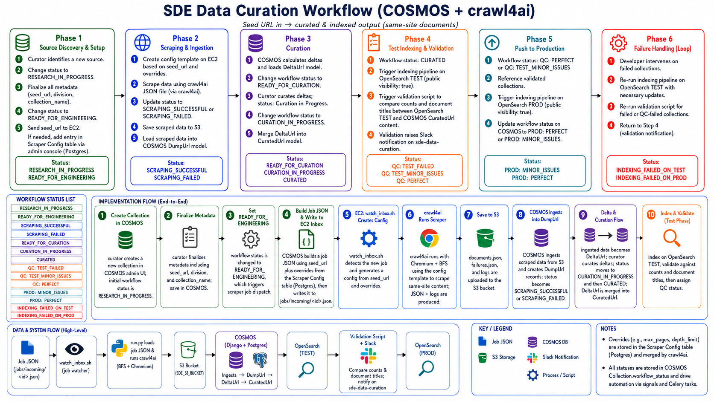

## SDE Data Curation Workflow — Dev Notes

> The diagram above is the canonical one-page view of this workflow; this document is its authoritative text. Where the two disagree, this document wins — the known differences are listed in [Where the diagram and this document differ](#where-the-diagram-and-this-document-differ) at the end. Deploy and rollback for the pipeline this workflow describes are in [sde_collections/DEPLOYMENT.md](./sde_collections/DEPLOYMENT.md).

### Phase 1 — Source Discovery and Setup

1. The curator identifies a new source for ingestion.

2. Update the COSMOS collection workflow status to **Research in Progress**.

3. Finalize all required metadata for the new source, including:

   * `seed_url`
   * `division`
   * `collection_name`
   * Any other required collection metadata

4. Update the workflow status to **Ready for Engineering**.

5. Send the collection `seed_url` to the scraper running on EC2 (the `sde-crawl4ai-scraper-v1` instance) by delivering a scrape job JSON to its inbox via **AWS SSM Run Command** — the instance has no inbound SSH; SSM is the access path.

6. When the collection requires changes to the default scraper settings, such as the maximum number of pages, manually add the applicable configuration overrides to the Postgres table through the admin console.

---

### Phase 2 — Scraping and Ingestion

7. COSMOS generates the job JSON from the collection `seed_url` and any scraper configuration overrides stored in Postgres, and SSM writes it into `jobs/incoming/` on EC2, where the inbox watcher picks it up.

8. Run the scraper using the delivered job configuration.

9. Update the collection workflow status based on the scraping result:

   * **Scraping Successful** when scraping completes successfully
   * **Scraping Failed** when the scraper encounters an error

10. The scraper saves the scraped data to S3 (`SDE_S3_BUCKET`): documents at `scraped_collections/<collection_id>.json`, failure logs at `failure_logs/<collection_id>_failures.jsonl` and `_failures_summary.json`.

11. Load the scraped data from S3 into the COSMOS `DumpURL` model.

---

### Phase 3 — Delta Processing and Curation

12. COSMOS calculates the differences between the latest scraped data and the existing curated data.

13. Load the calculated differences into the COSMOS `DeltaURL` model.

14. Update the collection workflow status to **Ready for Curation**.

15. The curator reviews and curates the delta records.

16. While curation is underway, update the workflow status to **Curation in Progress**.

17. After curation is complete, update the workflow status to **Curated**.

18. The **Curated** status triggers the merge of approved `DeltaURL` records into the `CuratedURL` model.

---

### Phase 4 — Test Indexing and Validation

19. For collections with the **Curated** status, trigger the indexing pipeline against the test OpenSearch (Serverless) instance — the same chunk → vectorize (SageMaker) → bulk-index pipeline the API scrapers (`sde-api-scrapers`) use.

20. Index the collection with `public_visibility` set to `true` in the web-document schema.

21. If test indexing fails, update the workflow status to **Indexing Failed on Test**.

22. After successful test indexing, trigger the validation script.

23. The validation script compares the following between the test OpenSearch index and the curated content in COSMOS:

* Total document count
* Document titles

24. Post the validation results to the `sde-data-curation` Slack channel.

25. Based on the validation results, update the collection workflow status to one of the following:

* **QC: Perfect**
* **QC: Minor Issues**
* **QC: Failed**

---

### Phase 5 — Production Indexing

26. Create or reference the list of collections that have passed validation with either:
* **QC: Perfect**
* **QC: Minor Issues**

27. Trigger the indexing pipeline for the validated collections against the production OpenSearch (Serverless) instance.

28. Keep `public_visibility` set to `true` during production indexing.

29. If production indexing fails, update the workflow status to **Indexing Failed on Prod**.

30. After successful production indexing, update the COSMOS collection workflow status to the production outcome that mirrors the QC verdict the collection entered with:

* **Prod: Perfect** — for collections that entered from **QC: Perfect**
* **Prod: Minor Issues** — for collections that entered from **QC: Minor Issues**

   A collection that passed validation with known minor issues still carries those issues in production, so the production status records that rather than flattening it to "Perfect." Both statuses already exist in COSMOS, and the Slack notification map already covers both transitions.

---

### Phase 6 — Failure Handling and Reprocessing

31. A developer reviews collections with any of the following failure statuses:
* **Scraping Failed**
* **Indexing Failed on Test**
* **Indexing Failed on Prod**
* **QC: Failed**

32. The developer identifies and applies the required scraper, configuration, data, or indexing changes.

33. For scraping failures, rerun the scraper and continue from the scraping and ingestion phase.

34. For test indexing or validation failures, invoke the indexing pipeline against the test OpenSearch instance with the required updates.

35. Invoke the validation script again for the QA-failed collections.

36. Post the updated validation results to the `sde-data-curation` Slack channel.

37. Repeat the test indexing and validation process until the collection reaches either:

* **QC: Perfect**
* **QC: Minor Issues**
38. After the collection passes validation, continue with the production indexing process.

---

## Repos for context
- /Users/bbenson/projects/sde-crawl4ai-scraper-v1
- /Users/bbenson/projects/sde-api-scrapers

## Workflow Status Progression

Research in Progress

        ↓

Ready for Engineering

        ↓

Scraping Successful

        ↓

Ready for Curation

        ↓

Curation in Progress

        ↓

Curated

        ↓

Test Indexing

        ↓

QC: Perfect / QC: Minor Issues

        ↓

Production Indexing

        ↓

Prod: Perfect / Prod: Minor Issues

### Failure Statuses

Scraping Failed

Indexing Failed on Test

Indexing Failed on Prod

QC: Failed

Collections in a failure status return to the applicable development, indexing, or validation step after corrective action is completed.

---

## Workflow Status List

The fourteen statuses a collection is expected to move through, in workflow order, with the `WorkflowStatusChoices` member and stored integer for each (`sde_collections/models/collection_choice_fields.py`). Statuses 21 and 23–25 are new for this pipeline; everything else already exists.

| Status label | Enum member | Value | Set by |
|---|---|---|---|
| Research in Progress | `RESEARCH_IN_PROGRESS` | 1 | Curator |
| Ready for Engineering | `READY_FOR_ENGINEERING` | 2 | Curator (triggers scrape dispatch) |
| Scraping Successful | `SCRAPING_SUCCESSFUL` | 21 | Ingestion task |
| Scraping Failed | `SCRAPING_FAILED` | 23 | Poller / ingestion task |
| Ready for Curation | `READY_FOR_CURATION` | 4 | Delta migration task |
| Curation in Progress | `CURATION_IN_PROGRESS` | 5 | Curator |
| Curated | `CURATED` | 6 | Curator (triggers promote + test indexing) |
| QC: Failed | `QUALITY_CHECK_FAILED` | 12 | Curator, from the validation report |
| QC: Minor Issues | `QUALITY_CHECK_MINOR` | 18 | Curator, from the validation report |
| QC: Perfect | `QUALITY_CHECK_PERFECT` | 13 | Curator, from the validation report |
| Prod: Minor Issues | `PROD_MINOR` | 15 | Prod indexing task (entered from QC: Minor Issues) |
| Prod: Perfect | `PROD_PERFECT` | 14 | Prod indexing task (entered from QC: Perfect) |
| Indexing Failed on Test | `INDEXING_FAILED_ON_TEST` | 24 | Test indexing task |
| Indexing Failed on Prod | `INDEXING_FAILED_ON_PROD` | 25 | Prod indexing task |

Two further statuses — **Test Indexing** (22) and **Production Indexing** (26) — exist only while an indexing task is actually running, so a stalled task leaves the collection visibly stuck rather than silently unchanged. They are implementation-internal and deliberately absent from the list above and from the diagram.

The diagram labels the QC statuses `QC: TEST_FAILED` and `QC: TEST_MINOR_ISSUES`, emphasizing that the QC gate is a judgment on the *test* index. Those are the existing **QC: Failed** (12) and **QC: Minor Issues** (18); no rename is proposed, since both values are live in production data, the Slack map, management commands, and the UI dropdowns.

---

## Where the diagram and this document differ

Three places where the diagram is loose or wrong. This document is correct in all three; they are recorded so the diagram's wording is not propagated into code or docs later.

1. **The crawler builds no "config template."** The diagram's Phase 2 step 1 and implementation-flow step 5 say `watch_inbox.sh` creates a config from the seed URL and overrides. It does not — `watch_inbox.sh` only watches the inbox with inotify and launches `run.py` under `flock`. `run.py` merges the job JSON's non-null overrides onto the crawler's own defaults; there is no separate template file or templating step.
2. **Phase 6 is broader than the diagram's box.** The diagram's Phase 6 shows only the indexing failure statuses and the loop back through validation. The failure-handling phase above also covers **Scraping Failed** and **QC: Failed**, which re-enter the pipeline at the scraping and test-indexing phases respectively.
3. **Phase 3's step numbering slips in the diagram.** Its steps 3 and 4 both land on "Curation in Progress," and the transition to **Curated** is only implied by step 5's merge. The authoritative sequence is steps 12–18 above: deltas loaded → Ready for Curation → Curation in Progress → Curated → merge into `CuratedUrl`.
